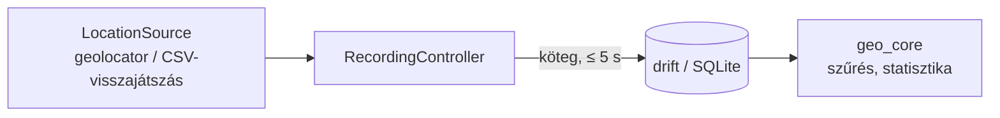

# Ösvény

**Offline túrarögzítő Androidra** – GPS-nyomvonal rögzítése internet nélkül, olyan módon, hogy a felvétel akkor is megmarad, ha kikapcsol a képernyő, háttérbe kerül az app, vagy az operációs rendszer kilövi.

Az Ösvény egy Flutter-alkalmazás és egy hozzá tartozó, tiszta Dart nyomvonal-feldolgozó könyvtár (`geo_core`). A projekt tanulási célú is: a geometriai algoritmusokat, a zajos szenzoradat szűrését és az összeomlás-biztos adatrögzítést a lehető legtisztábban, tesztekkel igazolva valósítja meg.

> **Állapot: fejlesztés alatt.** A rögzítő mag (M0–M2) kész és tesztelt; az offline térkép, a GPX és a felhasználói felület még nincs kész. Lásd a [Fejlesztési állapot](#fejlesztési-állapot) szakaszt.

## Mit tud (most)

- **GPS-rögzítés előtér-szolgáltatással** – állandó „Rögzítés folyamatban" értesítéssel, így zsebben, kikapcsolt képernyővel is fut.
- **Két profil** – *Pontos* (1–2 mp, nagy pontosság) és *Akkukímélő* (5 mp, 5 m távolságszűrő). A választás a túra rekordjában is megmarad.
- **Összeomlás-biztos mentés** – minden mérés nyersen, a pontossági adataival együtt kerül az SQLite-adatbázisba, legfeljebb 5 másodpercnyi késéssel. Ha az app megszakad, újraindításkor felajánlja a folytatást vagy a lezárást.
- **Szünet / folytatás / befejezés** – a szünetek külön szegmensként tárolódnak.
- **Engedélykezelés magyarázattal** – az első kérés előtt elmondja, miért kell a helyadat és az értesítés; megtagadás esetén érthető állapotot mutat.
- **Debug képernyő** – élő fix-lista, elfogadott/eldobott arány és a nyers adatok CSV-exportja (ezekből lesznek a visszajátszásos tesztek).

## Mit fog tudni (terv)

- Saját **vektoros offline térkép** PMTiles-fájlból (világos és sötét téma)
- **Tervezett útvonal betöltése GPX-ből** (pl. egy Kéktúra-szakasz) és **letérés-figyelmeztetés** rezgéssel és értesítéssel
- **Statisztika**: táv, szintemelkedés/-csökkenés, mozgásidő, átlagtempó, magassági profil
- **GPX-export és megosztás**, túralista
- Opcionálisan iOS

A teljes terv a [docs/SPEC.md](docs/SPEC.md)-ben van.

## A tervezés alapelve: a rögzítés túlélő folyamat, nem képernyő

A rögzítésnek túl kell élnie a kikapcsolt képernyőt, a háttérbe tett appot, az OS általi leállítást, a lemerülő akkut és az elvesző jelet. Ebből négy szabály következik:

1. **Nyersen mentünk, minden mást származtatunk.** A szűrés, a táv és a szintemelkedés tiszta függvényekből áll, amelyek bármikor újrafuttathatók a nyers adatokon. Szűrőhangolás után a régi túrák is újraszámolhatók, a szűrők pedig telefon nélkül, felvett nyomvonalak visszajátszásával tesztelhetők.
2. **Kötegelt, de gyakori írás.** Legfeljebb 5 másodpercnyi adat lehet csak memóriában.
3. **A rögzítés állapota is az adatbázisban él.** Induláskor az app felismeri a félbemaradt rögzítést.
4. **A tárigény nem gond.** Egy 8 órás, másodpercenkénti mintavételű túra kb. 29 000 sor, néhány MB.

## Hogyan dolgozza fel a nyomvonalat?

A `geo_core` szűrőlánca mellékhatás nélküli és determinisztikus. Az alapértékek konfigurálhatók:

| Lépés | Szabály |
|---|---|
| Pontossági kapu | `hAcc > 25 m` → eldob |
| Ugrásszűrő | 15 m/s feletti implikált sebesség → eldob (gyalogos profil) |
| Ritkítás | csak ≥ 3 m távolság vagy ≥ 30 s után kerül be új pont |
| Állásérzékelés | 0,3 m/s alatt 60 s-nál tovább → nem számít mozgásidőnek |
| Táv | haversine az elfogadott pontok között |
| Szintemelkedés | hiszterézis: csak a legutóbbi szélsőértéktől ≥ 5 m-es emelkedés számít |

**Miért hiszterézis a szintemelkedésnél?** A GPS függőleges hibája a vízszintes többszöröse. Ha naivan összeadnánk a magasságkülönbségeket, a zaj minden apró „fel-le" lépése emelkedésnek számítana, és a szintemelkedés sokszorosára nőne.

További algoritmusok a `geo_core`-ban: pont–töröttvonal távolság, Douglas–Peucker ritkítás és letérés-érzékelő (50 m-nél riaszt, 30 m-en belül oldja – a két küszöb közti sáv megakadályozza a villogást).

## Felépítés

```
packages/geo_core/   Tiszta Dart (nincs Flutter, nincs I/O): geometria, szűrőlánc,
                     statisztika, letérés-érzékelő, rögzítési állapotgép,
                     szintetikus nyomvonal-generátorok és CSV-visszajátszó
app/                 Flutter alkalmazás
  lib/data/          drift (SQLite) adatbázis
  lib/permissions/   engedélykérési folyamat
  lib/recording/     LocationSource (geolocator / CSV-visszajátszás), RecordingController
  lib/features/      debug képernyő
docs/                SPEC.md (specifikáció), DECISIONS.md (döntésnapló)
```



A helyforrás interfész mögött van, ezért a rögzítés GPS nélkül, CSV-ből visszajátszva is tesztelhető – a 30 perces séta integrációs tesztje is így fut.

## Fejlesztési állapot

| Mérföldkő | Tartalom | Állapot |
|---|---|---|
| M0 | Monorepó-váz, lint, CI | kész |
| M1 | `geo_core`: geometria, szűrőlánc, statisztika, letérés, állapotgép | kész |
| M2 | Rögzítés: engedélyek, előtér-szolgáltatás, drift, visszaállítás, debug képernyő | kész |
| M3 | Offline PMTiles-térkép | tervezett |
| M4 | GPX import/export, letérés-riasztás | tervezett |
| M5 | Statisztika-UI, magassági profil, barométer | tervezett |
| M6 | iOS | opcionális |

A valódi eszközön végzett ellenőrzések (hosszú séta képernyő nélkül, az app kilövése rögzítés közben, akkufogyás) a spec kézi ellenőrzőlistáján szerepelnek.

## Első lépések

Követelmények: Flutter SDK (Dart `^3.10.3`), Android SDK / eszköz vagy emulátor.

```bash
# geo_core tesztek
cd packages/geo_core
dart pub get
dart test

# alkalmazás
cd ../../app
flutter pub get
flutter test
flutter run            # csatlakoztatott Android-eszközön vagy emulátoron
```

Az adatbázis-kód generálása (a generált `*.g.dart` be van commitolva, így normál esetben nem kell):

```bash
cd app
dart run build_runner build --force-jit
```

Az emulátoron az *Extended controls → Location* panelen GPX játszható vissza, így a rögzítés asztalnál is kipróbálható.

## Adatvédelem

- Az app **semmit nem tölt fel és nem tölt le**: nincs fiók, nincs szinkron, nincs analitika. A túrák csak az eszközön tárolódnak.
- **Háttér-helyengedélyt nem kér** (`ACCESS_BACKGROUND_LOCATION`): a „használat közben" engedély és az előtér-szolgáltatás elég.
- A helyadatot a rendszer `LocationManager`-ével kéri, így nincs Google Play Services-függés sem.

## Ismert korlátok

- Az Ösvény egyelőre csak Androidra készül; az iOS-támogatás opcionális.
- Útvonaltervezés (routing) nincs, és nem is lesz.
- A tervezett Protomaps-alaptérképen az ösvények látszanak, de a turistajelzések és a szintvonalak nem – ezt a betöltött GPX pótolja majd.
- Az OSM csempeszerverről (tile.openstreetmap.org) tilos előtölteni vagy tömegesen letölteni; az app ezt nem is teszi.

## Dokumentáció

- [docs/SPEC.md](docs/SPEC.md) – teljes specifikáció, mérföldkövek, elfogadási forgatókönyvek
- [docs/DECISIONS.md](docs/DECISIONS.md) – tervezési döntések és azok indoklása (pl. függőség-pinnelések, helyszolgáltató-választás)

## Hozzájárulás

A projekt jelenleg egy személyes, tanulási célú fejlesztés. Hibajelzést és ötletet szívesen fogadok issue formájában. A kódolási szabályokat a [spec 13. fejezete](docs/SPEC.md) foglalja össze: tesztek először, formázás után `analyze` 0 hibával, minden teszt zöld.

## Licenc

[MIT](LICENSE)
