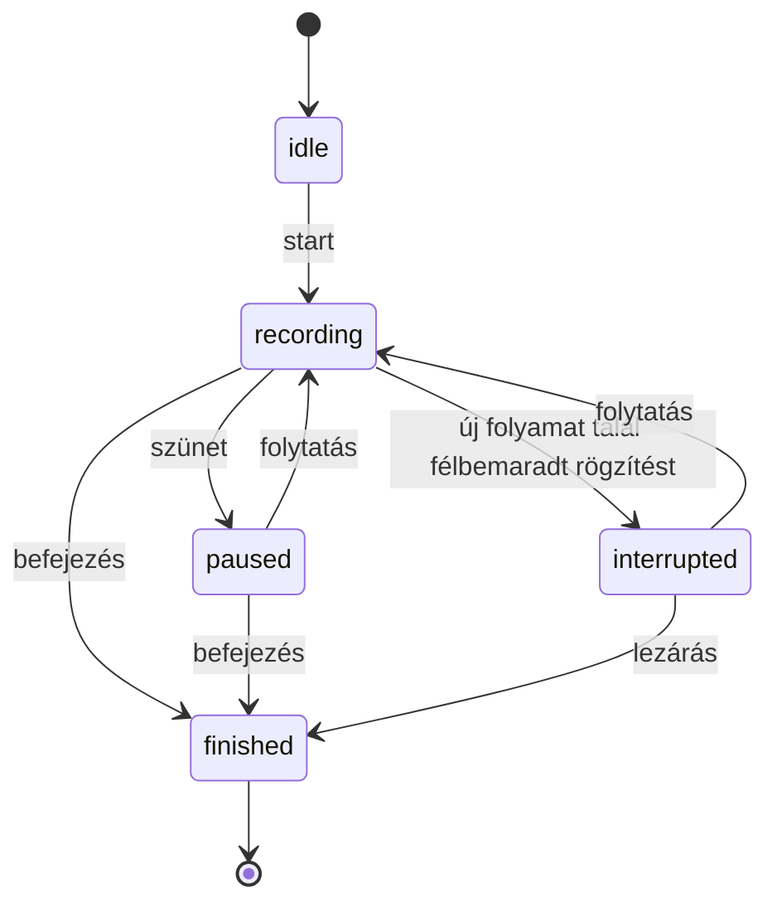
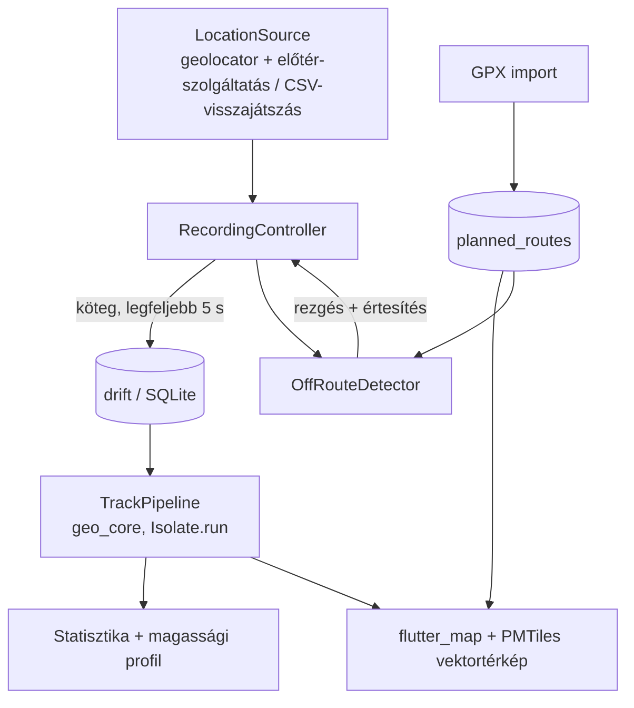

# Ösvény — offline túrarögzítő · Specifikáció

> A repóban a helye: `docs/SPEC.md`. A fejlesztési szabályokat a 13. fejezet foglalja össze.

## 0. Munkamenet

1. A spec a `docs/SPEC.md`, a döntésnapló a `docs/DECISIONS.md`; az eltéréseket a döntésnaplóba írjuk.
2. Mérföldkövenként: terv → jóváhagyás → feladatonként teszt, implementáció, `analyze` + `test`, commit.
3. Ami csak valódi eszközön ellenőrizhető (GPS, képernyőzár, akku, OS általi leállítás), az minden mérföldkő végén „Kézi ellenőrzés" listába kerül.

## 1. Cél

Túrák rögzítése GPS-szel, teljesen offline: saját vektoros térkép a telefonon, betölthető tervezett útvonal (pl. egy Kéktúra-szakasz GPX-e), letérés-figyelmeztetés, statisztika (táv, szintemelkedés, mozgásidő) és GPX-export.

| Tanulási cél | Hol |
|---|---|
| Geometriai algoritmusok: haversine, Douglas–Peucker, pont–töröttvonal távolság | M1 |
| Zajos szenzoradat szűrése, visszajátszásos tesztekkel | M1 |
| Háttérben futó helymeghatározás előtér-szolgáltatással; engedélyek, akku | M2 |
| Összeomlás-biztos adatrögzítés: perzisztált állapotgép, visszaállítás | M2 |
| drift/SQLite folyamatos, kötegelt írással, háttér-isolate-ben | M2 |
| Offline vektoros térkép PMTiles-ból | M3 |
| Nehéz számítás isolate-ben (`Isolate.run`) | M1, M3, M4 |

### Scope

| Benne van | Nincs benne |
|---|---|
| Rögzítés: indítás, szünet, folytatás, befejezés | Útvonaltervezés (routing) |
| Offline térkép saját PMTiles-fájlból | Online szinkron, fiók, közösségi funkciók |
| Tervezett GPX import, letérés-riasztás | Turistajelzések és szintvonalak megjelenítése (lásd 5. fejezet) |
| Statisztika, magassági profil | Wear OS, okosóra |
| GPX-export és megosztás, túralista | iOS (opcionális M6) |

## 2. A legfontosabb tervezési tény: a rögzítés túlélő folyamat, nem képernyő

A rögzítésnek túl kell élnie a kikapcsolt képernyőt, a háttérbe tett appot, azt, ha az OS megöli a folyamatot, a lemerülő akkut és a völgyben vagy alagútban elvesző jelet. Ebből négy elv következik:

- **Nyersen mentünk, minden mást származtatunk.** Minden GPS-mérés (fix) nyersen, a pontossági adataival együtt kerül az adatbázisba. A szűrés, a táv és a szintemelkedés egy tiszta függvénylánc eredménye, ami bármikor újrafuttatható. A szűrők finomhangolása után így a régi túrák is újraszámolhatók, a szűrők pedig telefon nélkül, felvett nyomvonalak visszajátszásával tesztelhetők.
- **Kötegelt, de gyakori írás.** Legfeljebb 5 másodpercnyi adat lehet csak memóriában.
- **A rögzítés állapota is az adatbázisban él.** Induláskor az app felismeri a félbemaradt rögzítést, és felajánlja a folytatást vagy a lezárást.
- **A tárigény nem kérdés.** Másodpercenkénti mérésnél egy 8 órás túra kb. 29 000 sor, néhány MB.

## 3. Helymeghatározás és engedélyek

- `geolocator` stream, Androidon a csomag előtér-szolgáltatásával (`ForegroundNotificationConfig`), állandó „Rögzítés folyamatban" értesítéssel.
- **Háttér-helyengedélyt (`ACCESS_BACKGROUND_LOCATION`) nem kérünk.** Ha az előtér-szolgáltatás akkor indul, amikor az app előtérben van, a „használat közben" engedély elég. Ez a Play-irányelvek szempontjából is sokkal egyszerűbb.
- Android 13+: `POST_NOTIFICATIONS` a szolgáltatás értesítéséhez. Android 14+: `location` típusú előtér-szolgáltatás és a hozzá tartozó engedély a manifestben. A pontos bejegyzéseket a `geolocator` aktuális README-je szerint kell felvenni.
- iOS (M6): „When In Use" engedély + `UIBackgroundModes: location` + a háttérfrissítés bekapcsolása, kék állapotjelzővel.
- Két profil, a túra rekordjában is rögzítve: **Pontos** (1–2 mp, nagy pontosság) és **Akkukímélő** (5 mp, 5 m távolság-szűrő).
- A helyforrás interfész mögött van (`LocationSource`), két megvalósítással: `GeolocatorLocationSource` és `ReplayLocationSource` (CSV-ből). A visszajátszó forrás integrációs tesztekhez és GPS nélküli demóhoz is jó.
- Fejlesztés közben az Android-emulátor Extended controls → Location paneljén GPX játszható vissza, így a rögzítés asztalnál is kipróbálható.

## 4. Nyomvonal-feldolgozás (`packages/geo_core`, tiszta Dart)

A szűrőlánc elfogadott pontokat és állapotot ad vissza, mellékhatás nélkül, determinisztikusan.

| Lépés | Szabály (alapértékek, konfigurálhatók) |
|---|---|
| 1. Pontossági kapu | `hAcc > 25 m` → eldob |
| 2. Ugrásszűrő | az előző ponthoz képest 15 m/s feletti implikált sebesség → eldob (gyalogos profil) |
| 3. Ritkítás | pont csak akkor kerül a nyomvonalba, ha ≥ 3 m-re van az előzőtől, vagy ≥ 30 s telt el |
| 4. Állásérzékelés | 0,3 m/s alatt, 60 s-nál tovább → az idő nem számít mozgásidőnek |
| 5. Táv | haversine az elfogadott pontok között |
| 6. Szintemelkedés | hiszterézis: az emelkedés csak akkor számít, ha az utolsó szélsőértéktől ≥ 5 m |

**Miért kell a hiszterézis:** a GPS függőleges hibája jellemzően a vízszintes többszöröse. Ha a magasságkülönbségeket naivan összeadjuk, a zaj minden apró „fel-le" lépése emelkedésnek számít, és a szintemelkedés sokszorosára nő. A hiszterézis a legegyszerűbb robusztus ellenszer. A barométer (M5, ahol az eszköz támogatja) pontosabb relatív magasságot ad, de az időjárással sodródik, ezért időnként a GPS-magasság mediánjához horgonyozzuk.

További algoritmusok:

- **Pont–töröttvonal távolság:** helyi ekvirektanguláris vetítés (néhány km-es környezetben a hiba elhanyagolható), szakaszonkénti merőleges vetület.
- **Letérés-érzékelés:** ha 3 egymást követő elfogadott pont 50 m-nél messzebb van a tervezett vonaltól → riasztás; 30 m-en belül visszatérve feloldás. A két küszöb közti sáv (hiszterézis) akadályozza meg a villogást. A keresés az utoljára illeszkedett szakasz körüli ablakban fut, és csak akkor esik vissza teljes keresésre, ha az ablakban nincs találat.
- **Douglas–Peucker ritkítás** megjelenítéshez, zoomszintenként eltérő tűréssel, isolate-ben.
- **Statisztika:** össztáv, mozgásidő, összidő, átlagtempó (perc/km, mozgásidőre vetítve), szintemelkedés és -csökkenés, legnagyobb magasság.

### Tesztadatok

- **Szintetikus generátorok:** egyenes vonal zajjal, álló „pontfelhő", adathiány (alagút), kiugró ugrás, oda-vissza út.
- **Valódi felvételek:** a debug menü nyers CSV-t exportál (`tMs,lat,lon,alt,hAcc,vAcc,speed`). Ezek a `packages/geo_core/test/traces/` mappába kerülnek, és visszajátszásos tesztek futnak rajtuk.
- **Referencia-táv:** atlétikai pálya belső sávja, 5 kör = 2000 m. Elfogadási határ: ±3%.

## 5. Offline térkép

- `flutter_map` + `vector_map_tiles` + `vector_map_tiles_pmtiles` (MIT licenc): helyi `.pmtiles` fájlból rajzol, Protomaps-témával (világos és sötét).
- A térképfájl nem kerül az APK-ba. Az app `file_picker`-rel importálja, és az app dokumentummappájába másolja.
- Előállítás a Protomaps napi planet-buildjéből, a `pmtiles` CLI-vel:
  ```
  pmtiles extract <protomaps build URL> hungary.pmtiles --bbox=16.11,45.74,22.90,48.59 --maxzoom=15
  ```
  Fejlesztéshez elég egy kis kivágat, pl. a Pilis és a Visegrádi-hegység: `--bbox=18.80,47.60,19.10,47.80`. A kapott fájlméreteket a README-be írjuk.
- **Ismert korlát:** a Protomaps alaptérképen az ösvények látszanak, de a turistajelzések (útvonal-relációk) és a szintvonalak nem. Ezt a betöltött tervezett GPX pótolja; a domborzat jövőbeli bővítés.
- **Tilos** a tile.openstreetmap.org-ról (vagy más, erre nem szánt szerverről) előtölteni vagy tömegesen letölteni. Az OSM csempeszerver-irányelve ezt kifejezetten tiltja.
- Attribúció: © OpenStreetMap contributors (ODbL) és Protomaps, a `flutter_map` `RichAttributionWidget`-jével.
- Teljesítmény: a rögzített nyomvonalat nem nyers pontokként rajzoljuk, hanem zoomsávonként ritkítva (DP isolate-ben, sávonként gyorsítótárazva), plusz a még nem ritkított „farkát".

## 6. GPX

- Olvasás és írás a `gpx` csomaggal. Az API-ját a pub cache-ben lévő forrásból kell ellenőrizni.
- Import: `trk` és `rte` is; több szegmens összefűzése; hibás vagy üres fájlra érthető hibaüzenet.
- A Kéktúra-szakaszok GPX-e a kektura.hu-ról kézzel letölthető. Az app semmit nem tölt le automatikusan.
- Export: GPX 1.1 időbélyeggel és magassággal, megosztás `share_plus`-szal. Ellenőrzés egy független eszközben, pl. a gpx.studio-ban.

## 7. Adatmodell (drift)

```
tracks          id, name, status (recording|paused|finished), profile,
                startedAtMs, endedAtMs?, plannedRouteId?, statsJson?  (lezáráskor számolva)
fixes           id, trackId, tMs, lat, lon, alt?, hAcc, vAcc?, speed?, bearing?
                index: (trackId, tMs)
segments        id, trackId, startTMs, endTMs?        (szünet/folytatás határai)
planned_routes  id, name, sourceFileName, points (Float64List blob: lat, lon, ele…),
                bbox, lengthM
```

- A drift adatbázis háttér-isolate-ben fut (`NativeDatabase.createInBackground`).
- Séma-migráció a drift `MigrationStrategy`-jével, minden migrációhoz teszt.

## 8. Rögzítési állapotgép (tiszta Dart)



Az `interrupted` nem tárolt állapot: induláskor vezetjük le, ha a DB-ben `recording` státuszú túra van, de a folyamat új.

## 9. Architektúra



### Könyvtárszerkezet

```
packages/geo_core/        tiszta Dart, nincs Flutter import
  lib/src/                geo.dart, filter_pipeline.dart, elevation.dart, stats.dart,
                          simplify.dart, off_route.dart, recording_state.dart
  test/traces/            valódi és szintetikus nyomvonalak (CSV)
app/
  lib/data/               drift db, DAO-k, gpx_io.dart
  lib/recording/          recording_controller.dart, location_source.dart (+ két megvalósítás)
  lib/map/                offline_map.dart, track_layer.dart, pmtiles_import.dart
  lib/features/           track_list/, track_detail/, planned_routes/, settings/, debug/
docs/                     SPEC.md, DECISIONS.md, ACCURACY.md, PERF.md
```

## 10. Mérföldkövek

Minden feladatra érvényes „Kész, ha" feltétel: formázás után az `analyze` 0 hibát ad, és minden teszt zöld (`dart test` a `geo_core`-ban, `flutter test` az `app`-ban).

### M0 — Monorepó-váz (≈2 óra)
- M0.1 `packages/geo_core` (`dart create -t package`), `app/` (`flutter create --org hu.seyuyo --project-name osveny --platforms android,ios`), path-függőséggel összekötve.
- M0.2 Lint: `flutter_lints` + `strict-casts`, `strict-raw-types`; `geo_core`-ban lint-szabály vagy teszt, ami tiltja a `package:flutter` importot.
- M0.3 GitHub Actions: mindkét csomagban analyze + test, `geo_core` lefedettségi riporttal.
- M0.4 `docs/DECISIONS.md` (12. fejezet).
- **Kész, ha:** a CI zöld.

### M1 — `geo_core`, test-first (≈8 óra)
- M1.1 Haversine és pont–szakasz távolság ismert referenciaértékekkel.
- M1.2 Douglas–Peucker ritkítás.
- M1.3 Szűrőlánc (4. fejezet) konfigurálható küszöbökkel, `update(fix) → (accepted?, state)` alakban.
- M1.4 Szintemelkedés hiszterézissel; statisztika.
- M1.5 Letérés-érzékelő ablakos kereséssel és hiszterézissel.
- M1.6 Rögzítési állapotgép (8. fejezet).
- M1.7 Szintetikus nyomvonal-generátorok és CSV-visszajátszó a tesztekhez.
- **Kész, ha:** ≥ 95% sorlefedettség; a szintetikus „álló pontfelhő" 10 perce alatt a táv < 20 m, és a mozgásidő 0.

### M2 — Rögzítés (≈10 óra)
- M2.1 Engedélykérés-folyamat: helyzet (használat közben), értesítés; magyarázó képernyő az első kérés előtt; megtagadás esetén érthető állapot.
- M2.2 `GeolocatorLocationSource` előtér-szolgáltatással, a két profillal.
- M2.3 drift séma, kötegelt írás (legfeljebb 5 s vagy 10 pont), háttér-isolate.
- M2.4 `RecordingController` az állapotgépre építve; indulási visszaállítás.
- M2.5 Debug képernyő: élő fix-lista, elfogadott/eldobott arány, nyers CSV-export.
- **Kész, ha:** integrációs teszt `ReplayLocationSource`-szal: egy 30 perces CSV végigjátszása után a DB pontosan a várt sorokat tartalmazza.
- **Kézi ellenőrzés:** 30 perces séta kikapcsolt képernyővel, zsebben: a nyomvonalban nincs 15 s-nál hosszabb rés (alagúton kívül). Rögzítés közben az app kilövése a legutóbbiak közül, majd újranyitása: felajánlja a folytatást, és legfeljebb 5 s adat vész el.

### M3 — Offline térkép (≈8 óra)
- M3.1 PMTiles import `file_picker`-rel, másolás a dokumentummappába, érvényesség-ellenőrzés.
- M3.2 Térkép Protomaps világos/sötét témával, attribúcióval.
- M3.3 Élő nyomvonal-réteg zoomsávos ritkítással; pozíció-jelölő; követő mód, ami kézi mozgatásra kikapcsol.
- M3.4 Teljesítménymérés profile módban egy 20 000 pontos nyomvonallal; az eredmény a `docs/PERF.md`-be kerül.
- **Kézi ellenőrzés:** repülőgép-üzemmódban a térkép teljesen működik; a pásztázás 20 000 pontos nyomvonallal is folyamatos.

### M4 — GPX és letérés (≈6 óra)
- M4.1 GPX import (`trk`, `rte`, több szegmens) → `planned_routes`, parszolás isolate-ben.
- M4.2 Tervezett útvonal megjelenítése; letérés-riasztás rezgéssel és értesítéssel, rögzítés közben.
- M4.3 GPX-export és megosztás.
- **Kész, ha:** egy 20 km-es szakasz-GPX importja és első megjelenítése 1 s alatt van a teszteszközön.
- **Kézi ellenőrzés:** az exportált GPX hibátlanul megnyílik a gpx.studio-ban, időbélyegekkel.

### M5 — Statisztika-UI és pontosság (≈6 óra)
- M5.1 Túralista és túra-részletek: statisztika, magassági profil (`fl_chart`).
- M5.2 Barométer-támogatás, ahol az eszköz tudja (`sensors_plus`), GPS-horgonyzással; kikapcsolható.
- M5.3 `docs/ACCURACY.md`: a pályás referencia-mérés eredménye, a szintemelkedés összevetése a tervezett GPX adataival, és minden szándékosan elhagyott korrekció, nagyságrenddel.
- M5.4 README: képernyőképek, architektúra-ábra, a 2. fejezet tanulsága.

### M6 — iOS (opcionális, macOS + Xcode kell, ≈6 óra)
- Háttér-helymeghatározás beállításai, engedélyszövegek, kék állapotjelző; a kézi ellenőrzőlista megismétlése iPhone-on.

## 11. Elfogadási forgatókönyvek

1. 60 perces séta, képernyő kikapcsolva, telefon zsebben: folytonos nyomvonal, alagúton kívül nincs 15 s-nál hosszabb rés; az akkufogyást a README rögzíti.
2. Rögzítés közben az OS (vagy a felhasználó) kilövi az appot: újranyitáskor az app felajánlja a folytatást, és legfeljebb 5 s adat vész el.
3. Egész túra repülőgép-üzemmódban: a térkép megjelenik, a rögzítés működik.
4. Atlétikai pálya, belső sáv, 5 kör: a táv 2000 m ±3%.
5. Egy Kéktúra-szakasz GPX-ét importálva a letérés-riasztás a vonaltól 50 m-nél messzebb, 3 ponton belül jelez, és nem jelez egy 30 m-en belüli párhuzamos ösvényen.
6. Az exportált GPX egy független eszközben helyes nyomvonalat és időbélyegeket mutat.

## 12. Döntésnapló

| Döntés | Választás | Alternatíva | Indok |
|---|---|---|---|
| Helymeghatározás | `geolocator` előtér-szolgáltatással | `flutter_background_geolocation` | Ingyenes; az alternatíva Androidon kiadáshoz fizetős licencet kér |
| Térkép | `flutter_map` + PMTiles | `maplibre_gl` offline régiók | Tisztán Flutter-oldali renderelés; egyetlen hordozható fájl |
| Csempe-gyorsítótár | nincs, saját PMTiles-fájl | `flutter_map_tile_caching` | Az alternatíva GPL-licencű, és a csempeszerverek irányelveibe ütközhet |
| Tárolás | drift | sqflite, isar | Típusos lekérdezések, migrációk, háttér-isolate beépítve |
| Mit tárolunk | nyers fixeket | szűrt pontokat | Újraszámolható, újrahangolható, visszajátszással tesztelhető |
| Háttér-engedély | nem kérünk | `ACCESS_BACKGROUND_LOCATION` | Előtérből indított előtér-szolgáltatás mellett nem kell |
| Állapotkezelés | Riverpod, kódgenerálás nélkül | Provider | Tanulási cél |

## 13. Fejlesztési szabályok

### Parancsok (Windows, PowerShell)
- `cd packages/geo_core; dart pub get; dart test --coverage=coverage`
- `cd app; flutter pub get; flutter analyze; flutter test`
- `cd app; dart run build_runner build` — drift kódgenerálás
- `cd app; flutter run --profile` — teljesítményt csak így és csak valódi eszközön mérünk

### Architektúra
- `packages/geo_core`: tiszta Dart. Nincs Flutter import, nincs I/O, nincs `DateTime.now()`.
  Minden bemenet paraméterként érkezik. A szűrők `update(fix) -> state` alakú, mellékhatás nélküli függvények.
- `app/lib/recording`: a `LocationSource` interfész mögött geolocator és CSV-visszajátszás.
- `app/lib/data`: drift, háttér-isolate-ben.

### Alapszabályok
- A DB-be a nyers fix kerül. Szűrt pontot, távot, szintemelkedést nem tárolunk alapadatként;
  a `statsJson` csak gyorsítótár, bármikor újraszámolható.
- Rögzítés közben legfeljebb 5 s adat lehet csak memóriában.
- Háttér-helyengedélyt (`ACCESS_BACKGROUND_LOCATION`) nem kérünk.
- Csempeszerverről (pl. tile.openstreetmap.org) soha nem töltünk elő és nem töltünk le tömegesen.
- Szögek és koordináták: fok a tárolásban és az API-kon, radián csak `geo_core` belsejében;
  a mértékegység a változónévben látszik (`latDeg`, `distanceM`, `tMs`).
- Minden szűrő-változást visszajátszásos teszt kísér a `test/traces` nyomvonalain.
- Új függőség bevezetése előtt a döntést a `DECISIONS.md`-be rögzítjük.
- Feladatonként: teszt → implementáció → format + analyze + test zöld → commit (conventional commits).

## 14. Nyitott kérdések

- Melyik telefon a terepi teszteszköz? A gyártói akkukímélő viselkedése miatt számít.
- Melyik Kéktúra-szakasz legyen a referencia-útvonal?
- A térképfájl egész Magyarországra készüljön, vagy régiónként több kisebb fájl legyen?
